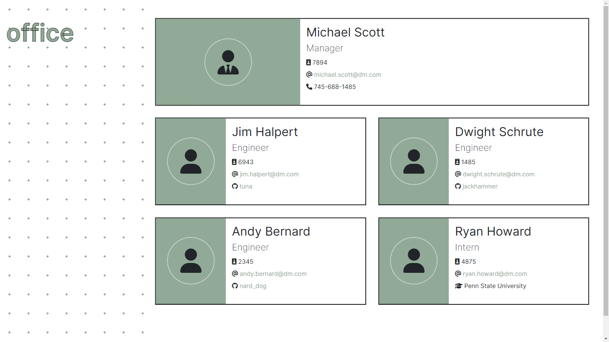
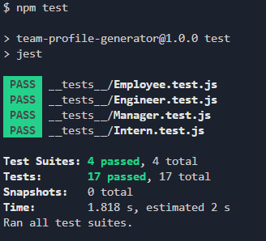

# Team profile generator


## About

This CLI node.js application generates an HTML file that displays essential information about a software engineering team's employees, such as their emails and GitHub profiles. Team generator prompts the user with _Inquirer_ to provide details about the employees.

_Application is passing all the provided tests._

## Table of Contents

1. [Installation](#installation)
2. [Usage](#usage)
3. [Tests](#tests)
4. [Tools](#tools)
5. [Credits](#credits)
6. [Contributing](#contributing)

## Installation

To use this application, fork the repository and clone it to your local environment with:

```
git clone git@github.com:<user>/team-profile-generator.git
```

Then install necessary dependencies with:

```
npm i
```

## Usage

The application can be invoked in the root directory of the application with the following command:

```
node index.js
```

You will then be prompted for all the information about the project.

Your generated file will use pre-existing template:


Full preview video available [here](link)

## Tests

Application utilises Jest for perfoming tests. Testing done with:

```
npm test
```



## Tools

<div>
&nbsp;
&nbsp;
&nbsp;
&nbsp;
&nbsp;
&nbsp;
&nbsp;
</div>

## Credits

- [Inquirer](https://www.npmjs.com/package/inquirer)
- [js-beautify](https://www.npmjs.com/package/js-beautify)
- [Inter Font](https://fonts.google.com/specimen/Inter)
- [Polka-dot in css](https://www.30secondsofcode.org/css/s/polka-dot-pattern)

## Contributing

Contributions are always welcome!

[](https://www.contributor-covenant.org/version/2/1/code_of_conduct/)

### Creating A Pull Request

- Fork the project
- Create your feature branch (`git checkout -b feature/newfeature`)
- Commit your changes (`git commit -m 'Add feature'`)
- Push to the branch (`git push origin feature/newfeature`)
- Open a Pull Request

Copyright &copy; 2023 [:octocat:@alexandrabatrak](https://github.com/alexandrabatrak)

<hr><p style="text-align:right; font-style:italic">This README was generated with ❤️ by <a href="https://github.com/alexandrabatrak/readme-generator">readme-generator</a></p>
